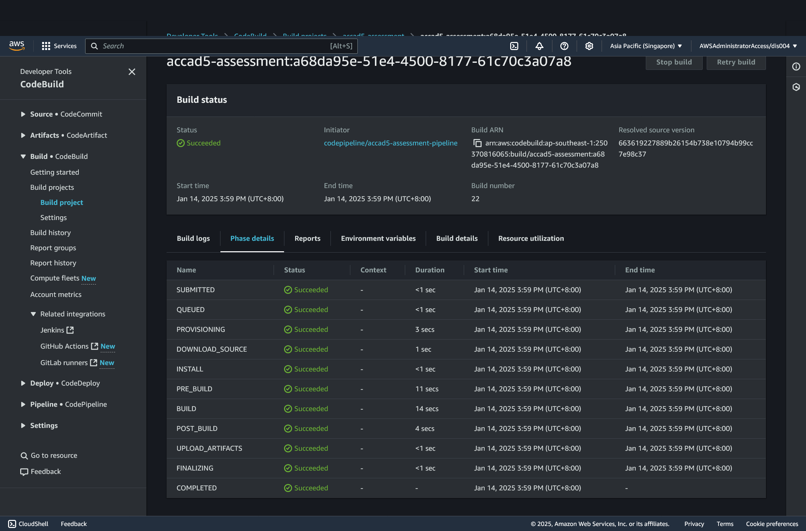

# ACCAD 5 Assessment

## Documentation

Website: https://xa3ma9ttqn.ap-southeast-1.awsapprunner.com/

Github: https://github.com/lxdryan/accad5-assessment

### Steps

Changes pushed to Github will trigger CodePipeline which builds the Docker image and pushes it to ECR which causes AppRunner to pull the image and deploy it.

## Images

_CodeBuild_

_S3_

_CodePipeline_

_AppRunner_